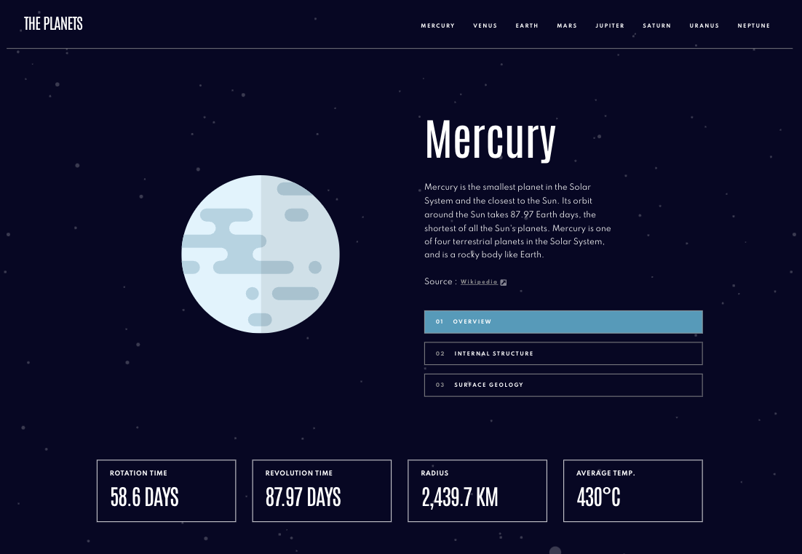

# Frontend Mentor - Planets fact site solution

This is a solution to the [Planets fact site challenge on Frontend Mentor](https://www.frontendmentor.io/challenges/planets-fact-site-gazqN8w_f). Frontend Mentor challenges help you improve your coding skills by building realistic projects.

## Table of contents

- [Overview](#overview)
  - [The challenge](#the-challenge)
  - [Screenshot](#screenshot)
  - [Links](#links)
- [My process](#my-process)
  - [Built with](#built-with)
  - [What I learned](#what-i-learned)
  - [Useful resources](#useful-resources)
- [Author](#author)

## Overview

### The challenge

Users should be able to:

- View the optimal layout for the app depending on their device's screen size
- See hover states for all interactive elements on the page
- View each planet page and toggle between "Overview", "Internal Structure", and "Surface Geology"

### Screenshot

### Links

- Solution URL: [Github repo](https://github.com/mrcordova/planets-fact-site)
- Live Site URL: [Github page](https://mrcordova.github.io/planets-fact-site/)

## My process

### Built with

- Semantic HTML5 markup
- CSS custom properties
- Flexbox
- CSS Grid
- Mobile-first workflow

### What I learned

I learned how to update css variables in javascript.

### Useful resources

- [Example resource 1](https://stackoverflow.com/questions/41370741/how-do-i-edit-a-css-variable-using-js) - This helped me to update css variables.

## Author

- Website - [Noah](https://noahs.software)
- Frontend Mentor - [@mrcordova](https://www.frontendmentor.io/profile/mrcordova)
